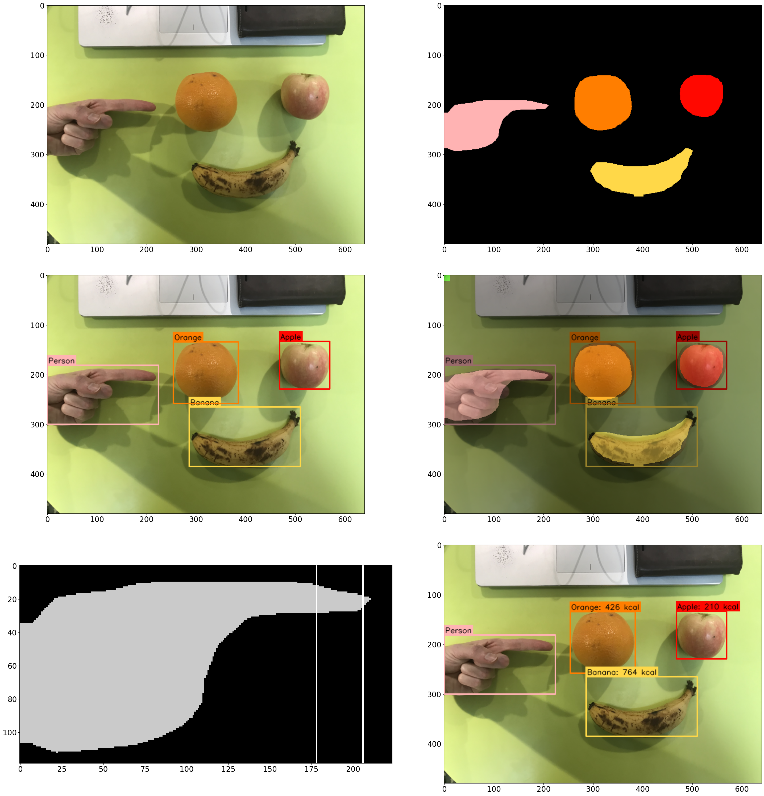

# Food Calorific Estimation
This project is about detecting and estimating the calories of the food via an image using machine learning, and computer vision. Mask-RCNN Inception v2 is the algorithm from TensorFlow Object Detection API (version 2018_01_28) (https://github.com/opencv/opencv/wiki/TensorFlow-Object-Detection-API#use-existing-config-file-for-your-model) that does both the object detection and image segmentation. 
This Python project is currently limited to detect only a person (finger), apple, banana and orange for the object detection.

The finger is used as the object calibration to calibrate the scale of the image to approximate the number of pixels per cm based on the width of the user's finger in the image. The accuracy of the result depends on the quality of the image segmentation of both the finger and fruit.

## Setup & Installation

Make sure you have the latest version of Python installed.

```bash
git clone <repo-url>
```

Important! Make sure you are in a Python Virtual Environment before using pip install.

For Windows:
```bash
python -m venv venv
venv\Scripts\activate
```

For Mac and Linux:
```bash
python3 -m venv venv
source venv/bin/activate
```

Once you are in the virtual environment, install the packages:
```bash
pip install -r requirements.txt
```

## Running The App

Open the main Jupyter File `main.ipynb` and change the `img_file` and `img_path` variables to a desired input image and run the main Jupyter file. Output may not always work properly due to finger and fruit positioning, lighting in the image and the background.

## Example Output

    ---------------------- FINGER CLASS --------------------
    SIDE: [0.0, 'Person', 0.75483173, 0, 181, 224, 300, (-1, 161, 58, 181, 2, 177)]
    TOP: None
    
    -------------------- FRUIT/VEGETABLES ------------------
    SIDE: [0.0, 'Orange', 0.7555651, 254, 134, 385, 258, (253, 114, 314, 134, 256, 130)]
    TOP: None
    
    SIDE: [0.0, 'Banana', 0.9660421, 286, 265, 510, 385, (285, 245, 349, 265, 288, 261)]
    TOP: None
    
    SIDE: [0.0, 'Apple', 0.9418785, 468, 133, 569, 229, (467, 113, 514, 133, 470, 129)]
    TOP: None
    
    FRUIT/VEGETABLE STATS
    -------------------------------------------------
    Orange area (cm2): 87.13223140495867
    Orange volume (cm3): 1193.07203429199
    Orange mass (grams): 906.7347460619123
    Orange calories (kcal): 426.1653306490988
    -------------------------------------------------
    Banana area (cm2): 85.9504132231405
    Banana volume (cm3): 1362.6250978873045
    Banana mass (grams): 858.4538116690019
    Banana calories (kcal): 764.0238923854117
    -------------------------------------------------
    Apple area (cm2): 50.02479338842975
    Apple volume (cm3): 761.2157907852824
    Apple mass (grams): 403.44436911619965
    Apple calories (kcal): 209.79107194042382
    -------------------------------------------------
    
    Number of pixels in 1cm line: 11
    




